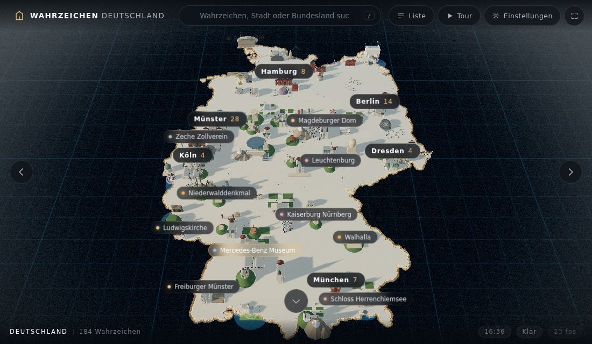
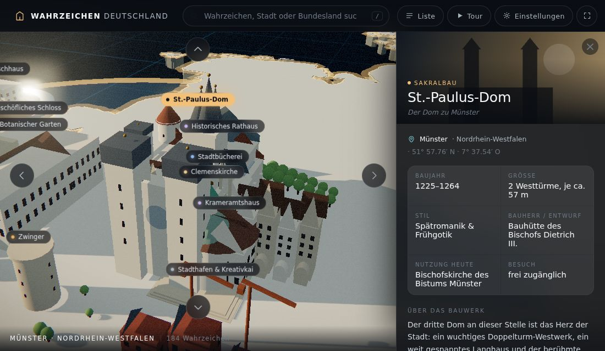
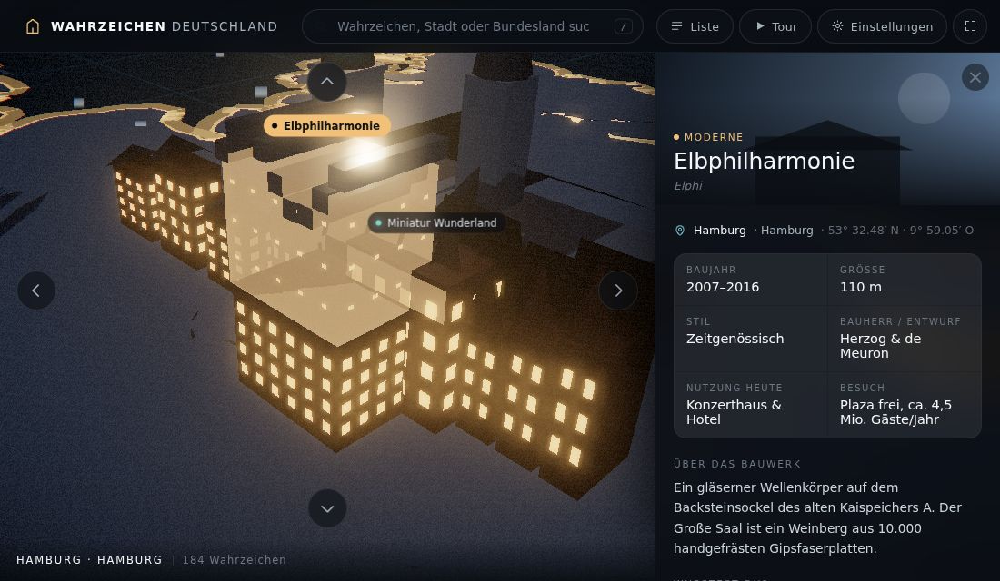

# Wahrzeichen Deutschland · 3D

Eine cinematische 3D-Karte mit **184 Wahrzeichen aus ganz Deutschland** – mit
besonderem Schwerpunkt auf **Münster (28 Bauwerke)**.

Die Bundesländer sind aus echten Geodaten extrudiert, jedes Wahrzeichen steht an
seiner tatsächlichen geografischen Position und ist als eigenes prozedurales
3D-Modell gebaut. Tageszeit, Wetter und Bildlook lassen sich frei einstellen.



| Münster aufgefächert | Nachts bei Regen |
| --- | --- |
|  |  |

---

## Was die Seite kann

**Karte & Modelle**
- Deutschland als extrudierte Platte mit Bundesländergrenzen, glühendem
  Staatsumriss, den zehn großen Flüssen und einem Raster auf dem Meer.
- 184 Wahrzeichen, jedes mit eigenem Modell aus einer Bibliothek von 56
  Bauwerkstypen – vom gotischen Doppelturm-Dom über den Doppelbock der Zeche
  Zollverein bis zur Wellenkrone der Elbphilharmonie.
- Kein einziges externes Bild oder Modell: alle Geometrien und Texturen
  entstehen zur Laufzeit im Code.

**Städte fächern sich auf**
Wahrzeichen einer Stadt liegen in Wirklichkeit nur Hunderte Meter auseinander –
auf einer Deutschlandkarte wäre das ein einziger Punkt. Deshalb:

- Herausgezoomt zeigt eine Stadt nur ihre Leitbauten plus eine Marke mit der
  Anzahl („Münster 28“).
- Beim Hineinzoomen fächert sich die Stadt auf: alle Bauwerke rücken – ihrer
  echten Lage zueinander folgend – auseinander, während der Rest der Republik
  weich zurücktritt.
- Die Auffächerung folgt einer Wurzelkennlinie, damit ein einzelner Ausreißer
  (etwa Haus Rüschhaus weit im Norden) den dichten Altstadtkern nicht
  zusammenquetscht.

**Navigation**
- **Pfeile an den Bildschirmrändern**: links/rechts durch die Wahrzeichen,
  oben zurück zur Deutschlandkarte, unten zur nächsten Stadt.
- Klick auf ein Bauwerk oder eine Stadtmarke, Volltextsuche, gefilterte Liste
  aller Wahrzeichen.
- **Steckbrief** am rechten Rand: Baujahr, Größe, Stil, Bauherr, Nutzung,
  Koordinaten, Beschreibung, ein „Wusstest du?“ und die Nachbarn in derselben
  Stadt. Das Bild verschiebt sich dabei so, dass das Bauwerk nicht hinter dem
  Panel verschwindet.
- **Kinotour** (`T`): fährt automatisch von Wahrzeichen zu Wahrzeichen.

**Einstellungen**
- Tageszeit als Regler (0–24 h) mit Stimmungs-Presets und optionalem
  automatischem Tageslauf – Sonnenstand, Himmelsfarbe, Schattenrichtung,
  Sterne und Fensterlicht folgen der Uhrzeit.
- Wetter: klar, bewölkt, Regen, Gewitter (mit Blitzen), Schnee, Nebel –
  jeweils mit Intensität, Wind und Dunst. Bei Regen werden die Oberflächen
  sichtbar nass.
- Bildlook: Leuchten (Bloom), Vignette, Filmkorn, Farbsaum, Sättigung,
  Kinobalken.
- Kamera: Blickwinkel, sanftes Kreisen. Karte: Beschriftungen, Einfärbung der
  Bundesländer, Flüsse, Raster. Qualität: niedrig / mittel / hoch.

Alle Einstellungen werden im Browser gespeichert.

---

## Starten

Die Seite braucht einen HTTP-Server (ES-Module und `import maps` laufen nicht
über `file://`):

```bash
python3 -m http.server 8000
# dann http://localhost:8000 öffnen
```

Kein Build-Schritt, keine Abhängigkeiten zu installieren – three.js liegt unter
`vendor/` im Repository, die Seite funktioniert also auch offline.

---

## Auf Vercel veröffentlichen

Die Seite ist rein statisch, `vercel.json` im Projektwurzelverzeichnis
konfiguriert Auslieferung und Caching. Es ist weder ein Framework-Preset noch
ein Build-Befehl nötig.

**Über die Weboberfläche**

1. Auf [vercel.com/new](https://vercel.com/new) das Repository importieren.
2. Framework Preset auf **Other** stehen lassen, Build Command und Output
   Directory leer lassen – Root Directory bleibt `./`.
3. **Deploy** klicken. Nach rund einer Minute liegt die Seite unter
   `https://<projektname>.vercel.app`.

**Über die CLI**

```bash
npx vercel        # Vorschau-Deployment
npx vercel --prod # Produktions-Deployment
```

Jeder weitere Push auf den Standardbranch löst automatisch ein neues
Produktions-Deployment aus, Pushes auf andere Branches erzeugen
Vorschau-URLs.

---

## Tastatur

| Taste | Wirkung |
| --- | --- |
| `←` `→` | vorheriges / nächstes Wahrzeichen |
| `↑` | zurück zur Deutschlandkarte |
| `↓` | nächste Stadt |
| `/` | Suche |
| `L` | Liste aller Wahrzeichen |
| `E` | Einstellungen |
| `T` | Kinotour |
| `C` | Kinobalken |
| `F` | Vollbild |
| `Esc` | Panels schließen |

---

## Aufbau

```
index.html                 Grundgerüst und Import-Map
assets/css/style.css       Oberfläche
src/
  main.js                  Einstiegspunkt, Renderer, Navigation, Bildschleife
  config.js                Projektion, Kamerastufen, Voreinstellungen
  util.js                  Mathematik, Easing, prozedurale Canvas-Texturen
  map.js                   Bundesländer, Umriss, Flüsse, Meer
  models.js                56 Bauwerkstypen aus Grundgeometrien
  world.js                 Städtegruppen, Auffächern, Sichtbarkeit
  environment.js           Himmel, Sonnenstand, Licht, Wetter
  postfx.js                Bloom, Vignette, Korn, Farbsaum
  cameraRig.js             OrbitControls plus weiche Kameraflüge
  labels.js                HTML-Beschriftungen mit Überlappungsschutz
  ui.js                    Panels, Steckbrief, Suche, Einstellungen
  data/
    landmarks.js           die 184 Wahrzeichen samt Steckbriefdaten
    germany.geo.js         vereinfachte Geometrie Deutschlands
vendor/three/              three.js r169 (MIT)
```

### Projektion

`config.js` bildet Geokoordinaten flächentreu auf die Bühne ab
(Mittelpunkt 51,16° N / 10,45° O, 16 Einheiten pro Breitengrad, also rund
7 km pro Einheit). Die Bauwerke sind bewusst stark überhöht – ein maßstäblicher
Dom wäre auf dieser Karte 0,014 Einheiten hoch und damit unsichtbar.

---

## Datenquellen

- Umriss und Bundesländer: [deutschlandGeoJSON](https://github.com/isellsoap/deutschlandGeoJSON)
  (Public Domain / GADM), mit Douglas-Peucker auf rund 10.000 Punkte vereinfacht.
- Angaben in den Steckbriefen sind gerundete, gut belegte Eckdaten; Höhen und
  Besucherzahlen verstehen sich als Größenordnung.
- [three.js](https://threejs.org) r169, MIT-Lizenz, unter `vendor/three/`.
